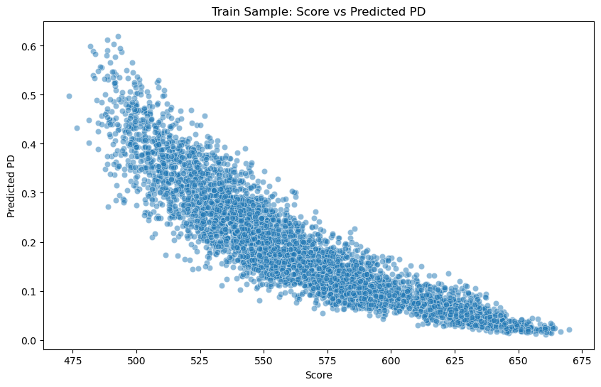
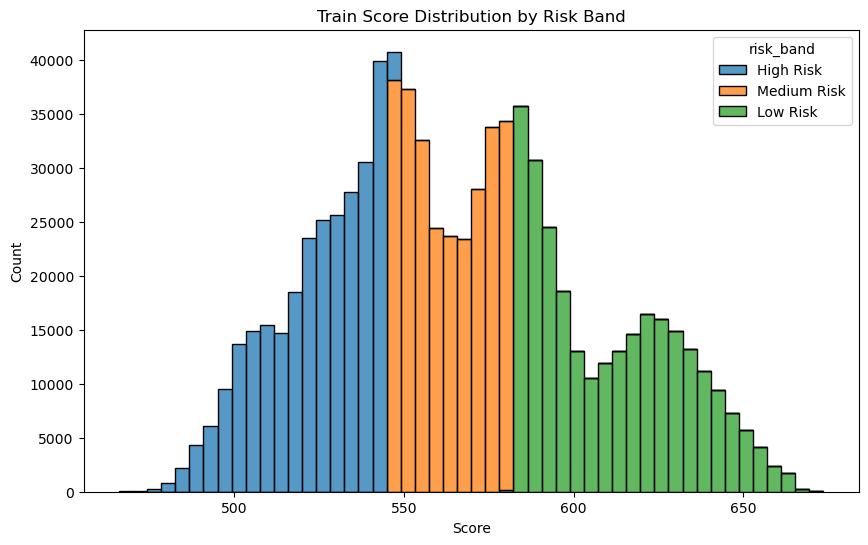
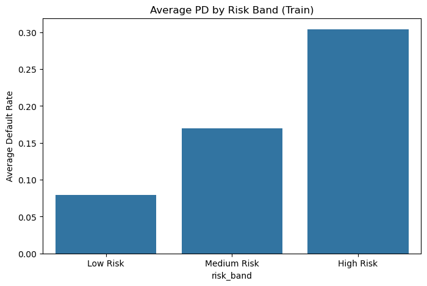
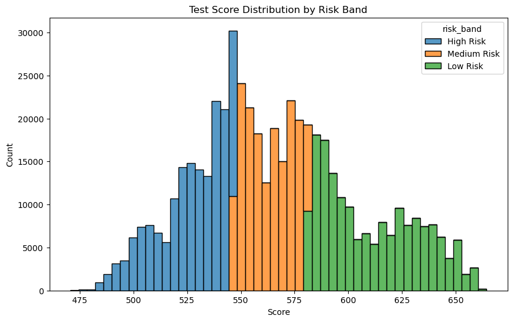
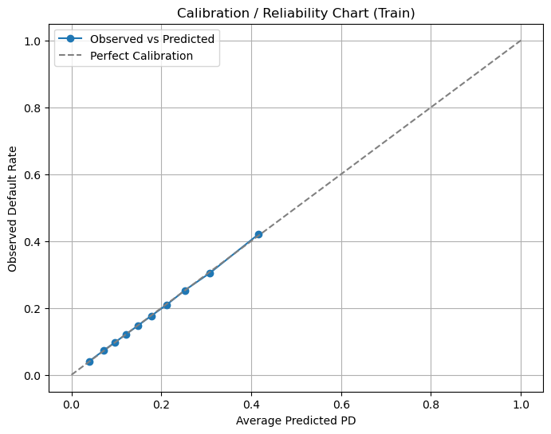
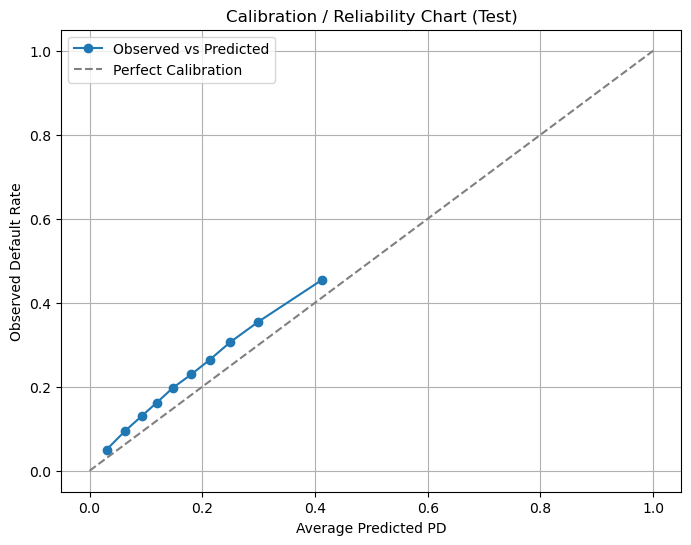
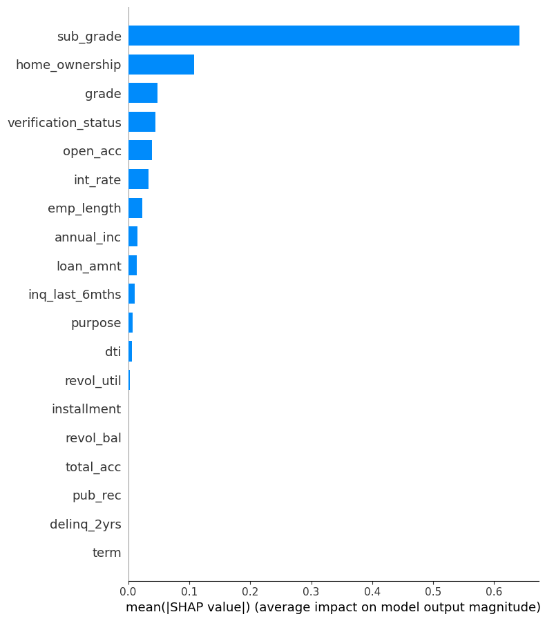
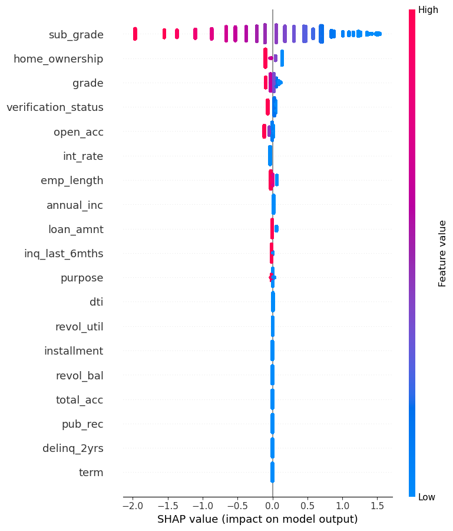
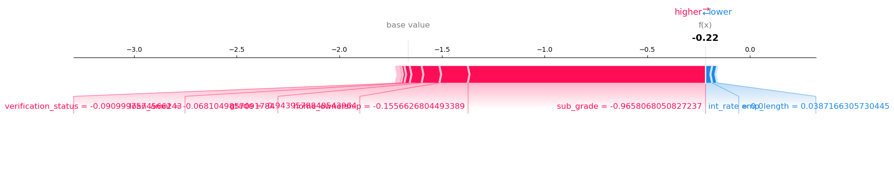

# Credit Risk PD Scorecard Project

## Project Overview

This project implements a **Credit Risk Modeling and Probability of Default (PD) Scorecard System** using real-world loan data.  
The goal is to predict the likelihood of default and translate it into an **actionable credit score** for business use.  
Additionally, **PD calibration** and **SHAP explainability** are included to make the model interpretable and reliable.

**Dataset**: The dataset link is as follows: [(https://www.kaggle.com/datasets/wordsforthewise/lending-club/data?select=accepted_2007_to_2018Q4.csv.gz)]

---

## Project Steps

### 1. Data Loading
- Raw LendingClub loan data (~1.5 GB) was loaded efficiently in chunks.
- Only relevant columns (loan amount, term, interest rate, employment length, credit history variables) were retained.

### 2. Target Definition
- Converted `loan_status` into a binary target:
  - `1` = defaulted (`Charged Off`, `Default`)  
  - `0` = fully paid
- Dropped ambiguous outcomes.

### 3. Time-Based Train/Test Split
- Split data based on `issue_d` to prevent data leakage.
- Train: loans issued before 2016  
- Test: loans issued from 2016 onward

### 4. Data Cleaning
- Converted percentages (`int_rate`, `revol_util`) to numeric.
- Converted categorical variables (`term`, `emp_length`) to numeric.
- Handled missing values using median imputation.

### 5. Feature Engineering & WoE Binning
- Created derived features (ratios, interactions) like:
  - `loan_amnt / annual_inc`
  - `int_rate * term`
  - `revol_util * dti`
- Transformed features into **Weight of Evidence (WoE)** values.
- Ensured no future leakage in test set.

### 6. Logistic Regression PD Model
- Fitted logistic regression on WoE features to predict PD.
- Predicted PD for train and test datasets.
- Evaluated using **AUC**:  
  - Train AUC ~0.71  
  - Test AUC ~0.69

### 6.5 PD Calibration & Reliability
- Applied **Platt scaling** to calibrate predicted PDs.
- Generated **reliability charts** to compare predicted vs observed defaults by decile.
- Updated `PD_calibrated` column in train and test datasets for downstream scoring and risk bands.

### 7. Scorecard Creation
- Converted model coefficients and WoE bins into **point-based scorecard**.
- Base score: 600, PDO (points to double odds): 20
- Computed individual scores for each observation using **vectorized computation** for speed.

### 8. Risk Bands and Visualization
- Defined **3 risk bands**: Low, Medium, High risk using score quantiles.
- Visualized PD distribution and score distribution across risk bands.
- Plots saved in `reports/`.

### 9. SHAP Explainability
- Used **SHAP values** to explain how each feature influences predicted PD.
- Generated:
  - Feature importance (bar)  
  - Feature impact distribution (beeswarm)  
  - Single loan explanation (force plot)

---

## Visualizations

### Score vs Predicted PD

### Train Score Distribution by Risk Band

### Average PD by Risk Band

### Test Score Distribution by Risk Band

### PD Calibration / Reliability Charts
- Train

- Test

### SHAP Feature Importance (Bar)

### SHAP Feature Impact (Beeswarm)

### SHAP Force Plot Example (Single Loan)

---

## Key Highlights
- Large-scale data (~1.5M loans) handled efficiently.
- Full **end-to-end pipeline**: data cleaning → feature engineering → WoE → logistic regression → PD calibration → scorecard → risk bands → SHAP explainability.
- Scorecard is **ready for business use**, with clear risk segmentation.
- Demonstrates **credit risk modeling skills**, **probability calibration**, and **model interpretability**.
